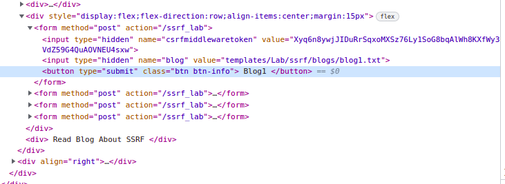
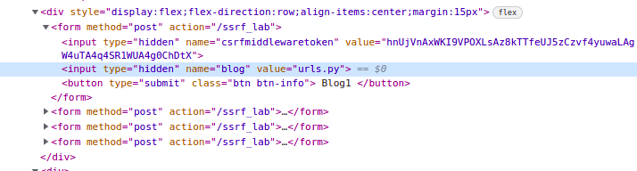
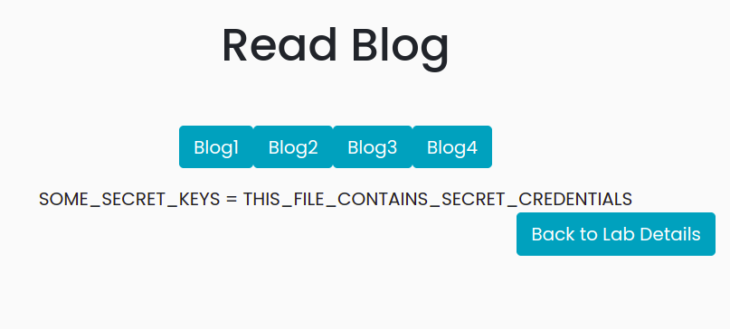

# Solutions to all the Lab Exercise  


## A1: Injection 
### Sql Injection
The user on accessing the lab is given with a login page,which challenges the user to login as admin.
The user now has to identify some mechanism to login as admin.
To test for sql injection ,the user can begin with a `'` or `"` based on the error generated he can confirm that it is an sql injection.
Search for common sql injections payloads in google and try using them to break the functionality of the backend code.

Since the challenge requires yout to login as admin, enter the `username` as  `admin` . The user now can use a very common sql injection paylaod to bypass the login validation
`anything' OR '1' ='1`.
Click login and now you will see that you have successfully logged into admins account.

#### Login :


On Successful injection


### Command Injection Lab 1
The user on accessing the lab is provided with a feature to perform a name server lookup on the given domain. The user has to give a domain name and the server would perform a ns lookup and return back to the client. If the user is running the lab, based on the OS he can select Windows or Linux.

The user can cause the server to execute commands ,because of the lack of input validation.

The user can give a domain say `google.com && [any cmd]` or `google.com; [any cmd]`

If the OS is windows, lets give input as `google.com && ipconfig` and choose windows.

If the OS is linux (Ubuntu, Kali, etc), lets give input as `google.com && ifconfig` and choose linux.

This should give you the output for both`ns lookup` as well as for the `ifconfig`.


### Command Injection Lab 2
We are given an input form where we can calculate basic arithmetic expressions. Our task is to exploit this functionality and achieve code execution. 

This lab is using `eval()` function in backend which is used to evaluate expression in python. If the expression is a legal python statement, then it will be executed. 

If we submit the expression `1 + 1`, we get the output as `2`. Similarly, on submitting the expression `7 * 7`, we get the output as `49`.

Now, if we submit `os.system("id")`, we get nothing in the output. But if we check the terminal, we will see that the command gets executed and the result is printed on the terminal screen. You can also verify this by submitting `os.system("sleep 30")`, and you will notice that the request completes after 30 seconds.

## A2:Broken Authentication

The main aim of this lab is to login as admin, and to achieve this, exploit the lack of `rate limiting` feature in the otp verification flow. You can see that the otp is only of 3 digit(for demo purposes) and neither does the application have any captcha nor any restriction on number of tries for the otp.

Now to send the otp to admins mail you need to figure out the admins mail id. Luckily the admin has left his email id for the developers in the page source. Admin's email id is `admin@pygoat.com` Enter this email in the send otp input box and hit send,you can see that the page says that otp is sent to the email id of the admin. 

In order to exploit the lack of rate limiting , we can try to Brute-force the 3 digit otp.

#### Steps to Brute force: 

* Open Burpsuite and configure your browser to intercept the web trafic, but dont turn intercept on.
* Send the otp to the admins mail id with the help of send otp feature.
* In the enter the otp box enter a random 3 digit number.
* Before your press login , turn intercept on on Burp suite and then press log in
* Now you can see that the traffic is captured in Burpsuite.
* Now use the send to intruder feature and send this request to the intruder.
* Set the position of the payload to the otp= parameter.
* Go to the payloads session and choose the payload type to number list
* Fill the range to 100 to 999 with step 1.
* Now click attack and you can see that the burp suite tries different combinations of otp and collects it response.
* You can figure out if it has guessed the correct opt by seeing the difference in length of the response for each request.
* The correct otp will have a small response length .
* Using this otp you will be able to login into admins account.

#### Brute forcing using BurpSuite

After sending OTP to admins EmailID, start up, Start up `BurpSuite`, turn intercept on and send any randon OTP in send OTP box


Once request is intercepted by burpsuite, click on `actions` and then `send to intruder`


Your intruder screen should look something like this. Parameters enclosed by the `§` symbol will be brute forced. 


Select payload type as Numbers, enter range as 100-999 and step as 1. Then start attack. 


When attack is going on, the correct OTP will have a different response length. In this case its smaller.

We see that OTP value 136 gives us a different lenght. 


It can also be found out by ordering by length


Lab 2


## A3:Senstive Data Exposure

The user has to find a way to trigger server error , so that the server throws some sensitive data in its error .
Here the developer has forgoten to turn ```debug to false``` which resulted in showing the ```settings.py``` file whihc has some sensitive data.
Try entering a ```random route``` to trigger the error and go through the settings.py file to find the sensitive data.

##### Triggering Error:


##### Finding the routes:


#####  Finding the flag :


## A4:XML External Entities

When the user clicks the button to save his comments, the data is sent to the server in th from of xml post request. This can be seen , by intercepting the request done to the server by that button using BurpSuite.
Sending data to the server in the form of XML is not actually vulnerable, the vulnerability lies in the way the xml is being parsed. An xml parsers which allows the DTD retrival is said to vulnerable to XXE injection if there arent any input validation done on the xml data.

##### Exploiting the XML Parser

* Open Burpsuite and make sure it is ready to capture the web traffic.
* Enter your comments in the input box provided.
* Before hiting the Let the world see button go to burpsuite and turn on intercept.
* Now you should be able to see a post request containing a xml data with your comment inside your the text tag.
* Now we need to introduce a DTD, which tries to fetch files from its server.
* This can be done by using the document tag and defining the Entity.

##### The Payload

``` 
<?xml version='1.0'?>
<!DOCTYPE comm [
<!ELEMENT comm (#PCDATA)>
<!ENTITY xxe SYSTEM "File_Path_Here">
]>
<comm>
<text>&xxe;</text>
</comm>
```

* Incase if the server is running linux then use file path `file:///etc/passwd` and if its running windows, use `C:\windows\system32\drivers\etc\hosts`. This will dump sensitive data about all users.
* Forward the request and turn off intercept.
* Go to the see comments option and click view comments this should show you the requested files in your payload if the vulnerability exists.

#### Solving with BurpSuite

Enter a random Input


The request is then intercepted in BurpSuite


Change the XML to the Malicious Payload


After forwarding and turning off the Intercept, return to browser and click on button to see your comments. Sensitive password data has been leaked.


## A5:Broken Access Control

On accessing the lab the user is provided with a simple login in page which requires a username and password.

The credentials for the user Jack is `jack:jacktheripper`

Use the above info to log in.

The main aim of this lab is to login with admin privileges to get the secret key.

#### Exploiting the Broken Access

Every time a valid user logs in,the user session is set with a cookie called `admin`
When you notice the cookie value when logged in as jack it is set to `0`
Use BurpSuite to intercept the request change the value of the admin cookie from `0` to `1`
This should log you in as a admin user and display the `secret key`

#### Solving Using BurpSuite

We can log in as `jack:jacktheripper` and admin cookie is set to 0. This does not give us the secret key


To change admin cookie in request, we open up burpsuite and after logging in, refresh the page and change value of admin cookie to 1


This results as being logged in as Admin


#### Solving using Browser 

Once again, we log in as `jack:jacktheripper`


In inspect section, change value of admin cookie to 1 and refresh the page. 


## A6:Security Misconfiguration

The user is provided with a button which, on clicking, says that `"Only admin.localhost:8000 can access, Your X-Host is None"`

With this information we can conclude that we need to have a header called `X-Host:` and its value should be ` admin.localhost:8000`.

In order to add this header we can capture the requet of the button in `BurpSuite` and add the header to the request and forward it .

This should give you the secret key.

#### Solving with BurpSuite

When request is initially intercepted in BurpSuite, the interceptor tab at the right of the screen should look like this 


Click the small `+` button to add a header


After header `X-host: admin.localhost:8000` has been added the interceptor tab and request data tab should show the new header


Now, click forward and turn off intercept to see Secret Key


## A7:Cross Site Scripting

* Instead of giving a search term try giving a html tag, ``` <h4 >Hello </h4>.```
* Now you can see that the word Hello has been parsed as a Heading in the page.
* This shows that the page is able to render the user given html tags.
* In order to get an xss , the user needs to execute javascript code in the browser.
* This can be acheived by using a script tag and malicious javascript code.
* For now let's just use a basic javascript code to alert a text to prove that xss is possible .
`<script >alert(“xss”) </script >`
* Now when a search query is performed with the above payload you can see that the browser is able to render the script tag and execute the javascript , thus alerting “xss” with a pop up.

#### Solving XSS in Browser

Entering input with `h4` and `font color` tags to check for XSS


Results page contains the word `TEXT` in Heading as well as Green color hence XSS Vulnerability is confirmed.


Now you can go ahead and enter `<script >alert(“xss”) </script >` once XSS is confirmed.

To see results on screen, make sure your browser has JavaScript enabled.

**Lab 3**
- ##### [ step- 1 ] Checking user input is being reflected or not
   - Though alphanumeric characters are being escaped we can still write js code with these 6 character `+`
   - check [jsfuck](http://www.jsfuck.com/)


## A8:Insecure Deserialization

This Lab consists of a Page that has some content only available to for the admin to see, How can we access that page as admin? How is our role defined?

If we check the cookie we see that it is base64 encoded, on decoding we realise it is pickle serialised and we can see some attributes, can you change the attributes to make the page readable?

Try to flip the bit of the admin from ```...admin\x94K\x00... to ...admin\x94K\x00...```

## A9:Using Components with Know Vulnerability

The user on accessing the lab is provided with a feature to convert yaml files into json objects. The user needs to choose an yaml file and click upload to get the json data. There is also a get version feature which tells the user the version of the library the app uses. 

##### Exploiting the vulnerability.

* The app uses```pyyaml 5.1 ``` Which is vulnerable to code execution.
* You can google the library with the version to get the poc and vulnerability details
* Create An yaml file with this payload:

```
!!python/object/apply:subprocess.check_output
- ls
```

* On Uploading this file the user should be able to see the output of the command executed.


## A10:Insufficient Logging & Monitoring

The user on accessing the lab is given with a login page which says the log have been leaked. The user needs to find the leak and try to gain the credentials that have been leaked in the logs.

##### Finding the Log

* The log has been exposed in ```/debug route```
* This can be found out with subdomain brute-forcing or just by guess
* On seeing the Log try to get the required login details as there is a leak and the logging is improperly handled.
* On looking at the log we can see a get request ot the server that has a username and password to it 
``` INFO "GET /a10_lab?username=Hacker&password=Hacker HTTP/1.1" 301 0 ```
* Now use the credentials to log in .

#### Solving using WebBrowser
 Route used is <http://127.0.0.1:8000/debug>


The Sensitive info is `INFO "GET /a10_lab?username=Hacker&password=Hacker HTTP/1.1" 301 0`

And this info can be used to log in with credentials `Hacker:Hacker`


# OWASP TOP 10 2021

## A4 : Insecure Design
This website is giving everyone free tickets ( upto 5 per person ). And the movie will be public when all the tickets will be sold.

Now, the ticket generating system is quite secure itself, and one can't get more than 5 tickets for free.
But there is a large design flaw. One can get all the tickets by creating multiple accounts. In this particular case, 5 tickets per page, and a total 60 required, so we need to create 12 accounts only and claim 5 tickets from each.

If the sign up process is lame, then this process can be automated. Strong verification/kyc verification needs to be taken in such situations .

## A10 : SSRF 
This websites serves some vlog, user need to figuer it out how this process is going 

* open dev tool and inspect the buttons

* Here we can see there is a hidden input tag which is taking file path of the blog as a parameter.
* now, if the path is not filltered correctly we can put file path of any file and access that.We just have to change the value.
* some example -- 




#### Now about our main Objective, finding the .env file
* normaly .env file is used to store all important credentials and configurations
* Usally this hidden file is saved a base directory
* So , this an trial and error method of searching 
* example : .env , ../.env, ../../.env
* solution :  ( ../.env) 



# Solutions to 2021 Challenges


## 2021-A1:Broken Access Control

**Lab 1**

On accessing the lab the user is provided with a simple login in page which requires a username and password.

The credentials for the user Jack is `jack:jacktheripper`

Use the above info to log in.

The main aim of this lab is to login with admin privileges to get the secret key.

#### Exploiting the Broken Access

Every time a valid user logs in,the user session is set with a cookie called `admin`
When you notice the cookie value when logged in as jack it is set to `0`
Use BurpSuite to intercept the request change the value of the admin cookie from `0` to `1`
This should log you in as a admin user and display the `secret key`

#### Solving Using BurpSuite

We can log in as `jack:jacktheripper` and admin cookie is set to 0. This does not give us the secret key


To change admin cookie in request, we open up burpsuite and after logging in, refresh the page and change value of admin cookie to 1


This results as being logged in as Admin


#### Solving using Browser 

Once again, we log in as `jack:jacktheripper`


In inspect section, change value of admin cookie to 1 and refresh the page. 


**Lab 2**

#### Exploiting the Broken Access

In this lab the broken access control is that an Admin field is Authenticated by the user agent field that can easily be changed
Use BurpSuite to intercept the request change the value of the `user-agent` to `pygoat_admin`
This should log you in as a admin user and display the `secret key`

#### Solving Using BurpSuite

We log in with `jack:jacktheripper` with request capturing on in Burpsuite.


We find a comment that leads us to finding critical info related to login


Then Change the user Agent Field.


This results as being logged in as Admin


**Lab 3**
#### We have an admin credential and a normal user credentails 
- We can 1st login using admin credential, then we can see there is a page at /broken_access_controle/secret containing secret
- 
- 
- Now if we logout from admin account and login to user account, we can't see the option for secret anymore. 
- Unfortunately if we browse to /broken_access_controle/secret we can still access the page because no authentication check was implemented at that page.
#### If real case senario hacker won't have admin credential, but he can still brute force with some existing text-list or common path dictionary
- Some tools to bruteforce file path 
  - [GoBuster](https://www.kali.org/tools/gobuster/)
  - [Burpsuit](https://portswigger.net/burp)

## 2021-A2:Cryptographic Failure

**Lab 1**
- Give material --> some user id and hash 
- ##### [ step- 1 ] Identification of the hash
   - the hash is 32 charecter long
   - most probably the hash is from MD* family
   - which is pretty weak hash ( weak in the sense , it have hash collision )
   - we can use [hash_identifier](https://hashes.com/en/tools/hash_identifier) to identify the hash
- ##### [ step - 2 ]  Search the hash in google
   - Got the hash of admin password, ie : `admin1234`
- ##### Using online Hash lookup service 
   - Using online hash decoder we can serach for commmon hash password.
- Final output 
   - 
#
**Lab 2**
- Given material --> some user id and hash 
- ##### [ step- 1 ] Identification of the hash
   - the hash is 64 charecter long
   - most probably the hash is SHA256
   - we can use [hash_identifier](https://hashes.com/en/tools/hash_identifier) to identify the hash
   - 
- ##### [ step - 2 ]  Search the hash in google
   - Didn't got any result
   - 
- ##### Using online Hash lookup service 
   - Using online hash decoder we can serach for commmon hash password.
   - No result found [ in this case ]
- ##### Using some password cracking tools [ Jhon the ripper ] or [ hashcat ]
   - No result
- ##### From the code we can see a custom function is used 
   - After reversing the admin hash and searching in online dictionary 
   - 
   - So `password777` is passowrd for admin, this gives use the admin access
- ##### Other solution ( bcause it quite difficult to guess custom hash function ) :
   - Brute force the login page ( no delay implemented so it would be better idea) using burp, Zed etc. 
#
**Lab 3**
- Given material --> Normal user credential 
- admin user name --> unkown, password --> unkown
- ##### Some ovservation
   - 
   - there is a cookie named `cookie` with a value `"User|2022-07-07 06:24:08.802299"` in the format "{username}|{timestamp}"
   - We can chage the cookie value with `"Admin|2022-07-07 06:24:08.802299"` ( Admin/admin/some other common admin name )
   - after some guessing we got "admin|2022-07-07 06:24:08.802299" is the admin cookie , which gives us admin access.
   - 
#
## 2021-A6:Using Components with Known Vulnerabilities

**lab-2**
- Given an utility to apply some math expression on an image
- 
- From the lab descripting we found this module uses pillow 8 
- After some OSINT and dorking 
- 
- Let's try `exec(exit())`
- 
- 
- Successfully triggerd a server error.


### 2021-A3:Server side Template Injection

`


    {{e.user.get_username}} : {{e.user.password}}
`

add a post which includes this content
 
The result would look like this -->


### 2021-A8: Software and Data Integrity failure
This data is a demonstration that how an XSS attack can deceive users to download any malicious file. The lab consists of a page to download a file, and a direct link to that page is also given (from a hacker). Let's download both files and compare the hash before opening that.

So as we can see the hashes don't match. So as a user we should always cross-check signatures for verification of Data Integrity. 

More more information about the attack itself you can look into the url --> 
```http://127.0.0.1:8000/2021/A8/lab2?username=user+%3Cscript%3Edocument.getElementById%28%22download_link%22%29.setAttribute%28%22href%22%2C%22%2Fstatic%2Ffake.txt%22%29%3B%3C%2Fscript%3Euser+%3Cscript%3Edocument.getElementById%28%22download_link%22%29.setAttribute%28%22href%22%2C%22%2Fstatic%2Ffake.txt%22%29%3B%3C%2Fscript%3E``` 
It have a file url and XXS attack to replace the actual file url.

### 2021-A9: Insufficient Logging & Monitoring
This lab have active logging and have a login page ( we don't have credential )
So every fake entry is logged so the user name is printed in the file itself..
```ERROR:root:2022-07-04 07:21:50.906938:127.0.0.1:User1:Hash1```
this is a sample hash ..
So we can Enter user name anything and password = ```pass\nERROR:root:2022-07-04 07:21:50.906938:127.0.0.1:User1:Hash1```
It will create one fake log and also it can cause log overflow also by passing lots of data in injection.

### 2021:A10 : SSRF lab2
This lab have a local page at ```/ssrf_target``` that can be only accesed from localhost. Now if we do ```python manage.py runserver``` that page will be accisible 
but if we start the server by ```python manage.py runserver 0:8000``` the page wont be accessble from ```http://[your ip]/ssrf_target``` 

Now comes the utility that takes the URL and fetch the data, if we give the localhost url to this utility it can fetch the data easily and we can see the page from outside localhost. 

